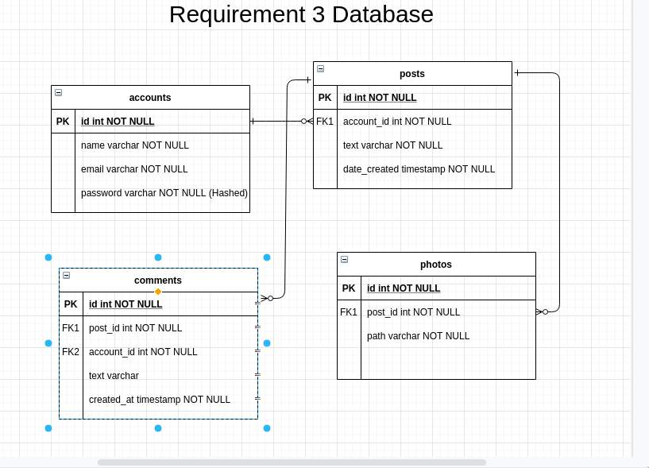

# node-coding-question

# Requirement 3 - *a work in progress*

AWS HOST: http://nodecodingchallengechukaikokwu-env.eba-3kcatndv.us-west-1.elasticbeanstalk.com/

## Req 3 requires the following new features:
1. A post can have multiple comments. Comments will show the user who commented and the comment.
2. Need to add pagination in the post and in the comments of the post.
3. User have the option to create their username. Update the user model.

*note*: UI is incomplete, I am focusing on the backend now to 
finish the requirements. These are the three main sections in 
the readme. Following this are the original requirements.

1. Starting the server
2. database structure
3. endpoints.

If you have specific questions about the 
implementation. Please send me an email at arpenacoding@gmail.com,
and I will be happy to explain, or we can set up a zoom meeting.

## Starting the server:

Starting the server requires certain environment variables to be set

DATABASE\_URL=postgres://yourusername@localhost:5432/dbname

ACCESS\_TOKEN\_SECRET=somethingHardToGuess

To start the server run:
`npm start`

To start the server in development mode run:
`npm run start:dev`

## Database:

To handle the requirement for a user to have multiple photos, 
I removed the photo attribute from the posts table and instead 
created a new table called photos which will have a FK to the post
which will allow a post to have more than one photo (max of 5).

To create the database simply run the migrations.

`npx sequelize db:migrate`

to remove all the tables in the database:

`npx sequelize db:migrate:undo:all`

## Endpoints

I used Postman to test the endpoints. 
The following lists the endpoints I defined along with a screenshot
of the postman configuration I used. Inside postman you can set the body 
of data I sent along with the path to the endpoint. 

***New endpoints in Requirement 2 are the following:***

1. GET    : '/posts/timeDifference'
2. PUT    : '/posts/setText'
3. DELETE : '/posts/deletePhoto'
4. DELETE : '/posts/deletePost'

***Also updated the createPost to allow for creating a post with 
multiple photos***

### **Age of post:**

GET: '/posts/timeDifference'

Response comes back as an object with a message and an age object 
that contains the age of the post (now() - posts.created\_at).

### **Edit post Text :**

PUT: '/posts/setText'

Accepts two json fields { postId, text } and sets the post that 
corresponds to the postId with the given text input.

### **Delete photo:**

This not only deletes the photo from the database but also delete 
the photo from the filesystem where the photos are being stored inside 
the photos folder.

DELETE : '/posts/deletePhoto'

### **Delete Post:**

This first deletes all the photos associated with the post as to not 
violate a foreign key constraint, then deletes the post itself.

DELETE : '/posts/deletePost'

### **Registering:** 

POST: '/register'

This endpoint accepts a JSON object with three fields: 
name, email, and password. It hashes the password using bcrypt 
and stores the hashed password in the database.

if the email is taken then it sends an http error 500.

### **Logging In:** 

POST: '/login'

This endpoint accepts a JSON object with two fields: email and password.
I used bcrypt to hash the password the user is attempting to login with, 
and then I compare that hash to the hash that is in the database, given 
that there exists an account with that email.

*This is the cookie that contains the JWT you are given.*

### **Creating a post:** 
POST: '/posts/createPost'

 
*note:* A post does not have to have a photo and can have at most 5.

Here you can send in up to five images as key value pairs. 
As long as the image data being sent has a mimetype of image 
the server should be able to add that file to the database as well 
as store it in the photos folder.

## Technologies to use for this coding question(Required):
* Node.js
* Express.js
* JWT
* Sequelize
* AWS EB
* AWS S3

## What all things you will be evaluated on?
* Naming conventions 
* Readability of the code
* Your file structure
* Error handling

## How to submit?
Reply back to the email with an open github repository.

## How you should work on it?
You work in an agile environment where your manager keeps on coming up with new requirements. The requirements are listed below, you have to change your code or your model and create migration files requirement by requirement. Create a branch and README.md(explaingin your approach to solve it) for each requirement listed below. Screenshots of the api call results are appreciated in README.md but not required.

## Requirements:
### Req1:
1. Create express.js app and use postgres sql as database.
2. Make routes where user can register itself. Required fields of user are name, email and password.
3. User can login with its email and password and gets a JWT token.
4. Logged in users can create a post. Post has 3 attribues title, description and a photo.

## Req 2:
Your manager next week talks to the client and gives you necessary changes to be made this week.
1. A post will have an attribute when it was created.
2. Post returning api will calculate the time difference like 2s ago, 10d ago, 4w ago, 8m ago and 1yr ago.
3. A post can have multiple photos but atmost 5.
4. A post can be editied.

## Req 3:
1. A post can have multiple comments. Comments will show the user who commented and the comment.
2. Need to add pagination in the post and in the comments of the post.
3. User have the option to create their username. Update the user model.

## Best of luck! Happy Coding! 
